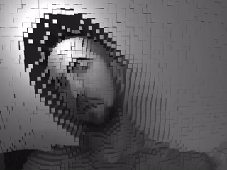

# PinPortrait — 3D Webcam Pixel Portrait

PinPortrait turns your webcam into a live 3D pixel portrait: every block of pixels
becomes a pin that rises out of a dark plane according to how bright it is. Orbit
around it, restyle it, and save a still.

Everything runs locally in the browser — no frames ever leave your device.

<div align="center">
  
</div>

## Getting started

The webcam is only handed out in a **secure context**, so opening `index.html`
straight from disk won't work — it has to be served.

```bash
npm install
npm run dev          # http://localhost:5173
```

Any static server works just as well:

```bash
python3 -m http.server 5173
npx serve .
```

Then open the URL and allow camera access when prompted.

## Controls

| Control | What it does |
| --- | --- |
| **Pin size** | Video pixels per pin. Smaller = denser, more detailed, heavier. |
| **Depth** | How far the pins extrude. At `0` you get a flat mosaic. |
| **Threshold** | Pins dimmer than this stay flat, lifting the subject out of a dark background. Colour still tracks real brightness. |
| **Smoothing** | How much each pin eases toward its new height. `0` snaps; higher gives the grid its ripple. |
| **Palette** | Mono, true Colour, or the Ember / Ice / Neon luminance gradients. |
| **Shape** | Pin (cylinder), Box, or Sphere. |
| **Mirror** | Flip horizontally so it behaves like a mirror. |
| **Auto-orbit** | Slow automatic rotation. |
| **Reset view / Save PNG** | Re-frame the camera, or download the current render. |

Drag to orbit, scroll to zoom, right-drag to pan.
Shortcuts: <kbd>H</kbd> hide the interface · <kbd>R</kbd> reset view ·
<kbd>S</kbd> save a PNG · <kbd>F</kbd> fullscreen.

Settings persist in `localStorage`.

## How it works

1. **Capture** — `getUserMedia` opens the camera at 1280×720 (ideal).
2. **Downsample** — each frame is drawn through a two-stage reduction into an
   offscreen canvas sized to exactly one pixel per pin. The browser's own image
   filter does the averaging.
3. **Read back** — a single `getImageData` on that grid-sized canvas.
4. **Drive the mesh** — for each pin, relative luminance sets the height and the
   active palette sets the colour, written straight into the instance buffers.
5. **Render** — one `InstancedMesh`, one draw call, however many pins there are.

## Performance

This started as a sketch that allocated one `Mesh` **and one material** per pin,
sampled the video at full resolution every frame, and averaged each block in a
nested JavaScript loop. At the default settings that meant ~9,000 draw calls and
a full-frame pixel readback per frame. The rewrite changes four things:

- **One draw call.** All pins live in a single `InstancedMesh` sharing one
  material. Only the z-scale and colour of each instance change per frame — the
  base transforms are written once.
- **The GPU does the averaging.** Downscaling via `drawImage` into a grid-sized
  canvas replaced the per-pixel JS loop, and the readback shrank from
  1280×720 to (for example) 128×72.
- **Work only when there's new input.** `requestVideoFrameCallback` means a
  30 fps camera is sampled 30 times a second, not 120 on a high-refresh display.
  Frames are only re-rendered when the video, the camera, or a setting changes.
- **Idle when hidden.** Switching tabs stops the render loop and disables the
  video track, so the camera light goes out and the GPU goes quiet.

There's also an adaptive quality step: if the frame rate stays below 40 fps, the
renderer's pixel ratio drops until it recovers. A hard ceiling of 26,000 pins
(`MAX_PINS` in `config.js`) stops a high-resolution camera at the smallest pin
size from asking for hundreds of thousands of instances — when it kicks in, the
pin-size readout says `capped`.

For reference, the test suite renders 25,560 pins at a steady 60 fps in headless
Chrome using **software rasterisation** (SwiftShader, no GPU).

## Project layout

```text
index.html                   shell, import map, overlay markup
src/javascript/sketch.js     scene, capture pipeline, render loop
src/javascript/ui.js         control panel, overlays, shortcuts
src/javascript/config.js     defaults, palettes, limits, persistence
src/styles/styles.css        interface styling
```

Three.js is loaded as an ES module from a CDN via an import map — no build step,
no bundler. Change the version in one place in `index.html`.

## Customising

- **Add a palette** — drop an entry into `PALETTES` in
  [`config.js`](src/javascript/config.js). It gets a chip in the panel
  automatically. Each palette receives the sRGB channels plus luminance and
  writes into a reused `THREE.Color`; don't allocate in there, it runs once per
  pin per frame.
- **Add a shape** — extend `SHAPES` and the `switch` in `buildGeometry()`.
  Geometry must span `z ∈ [0, 1]` with its base at the origin so scaling z
  extrudes it correctly.
- **Change the defaults** — `DEFAULTS` and `LIMITS` in `config.js`. Stored
  settings are validated against them on load, so tightening a limit is safe.
- **Relief and framing** — `RELIEF` and `GRID_WIDTH` in `sketch.js`. The grid is
  always `GRID_WIDTH` units across whatever the pin count, which is why changing
  pin size re-densifies the portrait instead of resizing it.

## Credits

Based on the original [3D webcam pixelation experiment][orig] by
**Johan Karlsson** ([DonKarlssonSan](https://github.com/DonKarlssonSan)), rebuilt
around instanced rendering with an interface, palettes and error handling.

[orig]: https://codepen.io/DonKarlssonSan/

Licensed under the MIT License — see [LICENSE](LICENSE).
