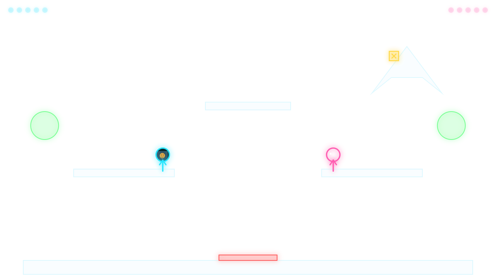

# WallBrawl 👊 — Projection-Mapped Stick Figure Fighting Game

**Turn any wall into a multiplayer arena.** WallBrawl is a free, open-source, local-multiplayer stick-figure brawler built for projection mapping: point a projector at your living room wall, outline your real shelves, couches, and picture frames as platforms, and fight your friends across the furniture.

Built with **plain HTML5 Canvas and vanilla JavaScript — zero dependencies, no build step, no install**. Open one file and play.



▶ **[Play it now](https://giorgosn.github.io/wallbrawl/)** — works in any modern browser, no projector required.

Inspired by [Stick Fight: The Game](https://store.steampowered.com/app/674940/Stick_Fight_The_Game/) and [this r/video_mapping post](https://www.reddit.com/r/video_mapping/comments/1umoohp/) of a wall-projected brawler.

## Features

- 🥊 **2-player local multiplayer** — keyboard or gamepads, couch-game style
- 📽️ **Projection mapping built in** — 4-corner calibration (corner-pin / keystone warp) maps the game onto any wall, no external mapping software
- ⬠ **Freeform polygon editor** — outline *any* real object (sofa, shelf, guitar on the wall) by clicking its corners; drag corners to fine-tune, works with concave shapes
- 🙂 **Your face on the fighter** — upload a photo for each player's head, with a crop editor (drag / zoom / rotate) — bobblehead style
- 🔫 **Weapon crates** — pistol, uzi, shotgun drop from above; dying drops your loaded gun
- 🟢 **Shape types** — invisible platforms (the real furniture is the level), deadly spikes, bouncy trampolines
- 🎮 **Full Gamepad API support** — run the whole thing from the couch, no keyboard at the projector
- 💾 **Arenas autosave** to localStorage; export/import as JSON to share your room layout
- 🔊 **Synthesized sound** — WebAudio, no audio files
- 📦 **Single-file build** — `node build.js` bundles everything into one standalone HTML file

## Quick start

```
git clone https://github.com/giorgosn/wallbrawl.git
```

Open `index.html` in a browser. That's the whole install.

Optional single-file bundle (easy to copy to the projector machine):

```
node build.js       # → dist/wallbrawl-standalone.html
```

## How to play on a wall

> Fullscreen only works when the game is the top-level page (open `index.html`
> or `dist/wallbrawl-standalone.html` directly). Embedded previews block the
> fullscreen API — use F11 there instead.

1. Connect the projector as a second display, move the browser window onto it, fullscreen (`⤢ Full`).
2. Dim the room. Black pixels project as nothing — only the bright game shows.
3. Press `C` (Calibrate) and drag the four glowing corners until the dashed
   frame covers the wall area you want to play on.
4. In the editor, cover your real ledges and obstacles with shapes:
   **Box / Circle / Wall** for simple geometry, **⬠ Poly** for anything
   irregular — click around the object's outline, click the first point to
   close. Place **P1 / P2** spawn points, set stick figure **size**, and give
   each player a face with the **🙂 P1 / 🙂 P2** photo buttons.
5. `▶ Fight`. Turn off **ghost** (or press `G` in-game) so only the fighters,
   crates, and bullets are projected — the real wall is the level.

## Controls

|            | Player 1        | Player 2        | Gamepad (per player)   |
|------------|-----------------|-----------------|------------------------|
| Move       | A / D           | ← / →           | left stick             |
| Jump       | W or Space      | ↑               | A (double jump: press again in air) |
| Attack     | F               | L or .          | X or RT                |
| Aim down   | S               | ↓               | left stick (full aim)  |

Any gamepad button leaves the title screen; **Start** launches the fight from
the editor — no keyboard needed at the projector.

Punch when unarmed; weapon crates drop from above. Dying drops your weapon
(with its remaining ammo) for anyone to grab. Last stick standing scores;
first to 5 wins the wall.

**Editor keys:** `V` select · `B` box · `O` circle · `W` wall · `P` polygon ·
`X` erase · `1`/`2` spawn tools · arrows nudge 1px (`Shift` = 10px) ·
`Ctrl+Z` undo · `Ctrl+D` duplicate · `Del` delete · `Q`/`E` rotate box ·
`Enter` fight · `Esc` back to editor · `C` calibration · `M` mute.

**Polygon editing:** with a polygon selected — drag a corner to move it,
double-click an edge to add a corner, right-click a corner to remove it.
While outlining: `Enter` closes, `Backspace` removes the last point, `Esc` cancels.

## Shape types

| Type     | Color | Behavior                                             |
|----------|-------|------------------------------------------------------|
| platform | cyan  | Solid geometry matching your wall; invisible in play (unless ghost is on) |
| deadly   | red   | Spikes — touching it kills. Always projected.        |
| bouncy   | green | Trampoline — reflects whatever lands on it. Always projected. |

Platform shapes are the invisible stand-ins for real objects; deadly and
bouncy shapes are game elements, so they stay visible on the wall.

## Code map

The whole game is ~2000 lines of dependency-free JavaScript, deliberately
easy to read and hack:

| File               | What it does                                        |
|--------------------|-----------------------------------------------------|
| `src/util.js`      | math helpers + homography (corner-pin) solver       |
| `src/sound.js`     | WebAudio synth (no audio files)                     |
| `src/input.js`     | keyboard + Gamepad API, normalized per player       |
| `src/arena.js`     | arena model, localStorage persistence, JSON import/export |
| `src/physics.js`   | circle vs box/circle/polygon collision + resolution |
| `src/particles.js` | particle bursts                                     |
| `src/heads.js`     | custom head photos + crop editor modal              |
| `src/player.js`    | movement feel, combat, procedural stick figure      |
| `src/weapons.js`   | weapon table, crates, bullets                       |
| `src/calibrate.js` | 4-corner projection warp (CSS matrix3d)             |
| `src/editor.js`    | arena editor tools + toolbar                        |
| `src/game.js`      | state machine, fixed-step loop, rounds, HUD         |

## 🔧 Hack it — contributions wanted

This project is small on purpose: no framework, no bundler, no node_modules.
If you can write a `<canvas>` call, you can add a feature. **PRs, forks, and
wild experiments are very welcome.** Ideas up for grabs:

- Round modifiers — low gravity, falling snow, rising lava
- 3–4 players
- Throwable weapons, explosives, shields
- Named arena slots / arena gallery to share room layouts
- Phone-as-remote arena editing (WebRTC), like the original post's iPhone app
- Webcam head capture (snap your face instead of uploading)
- Depth-camera auto-mapping of the wall

There's no contribution ceremony: fork it, hack it, open a PR. If you map
your own wall with it, please open an issue with a photo — that's the whole
point of this project.

## License

[MIT](LICENSE) — do whatever you want with it, projector party encouraged.
